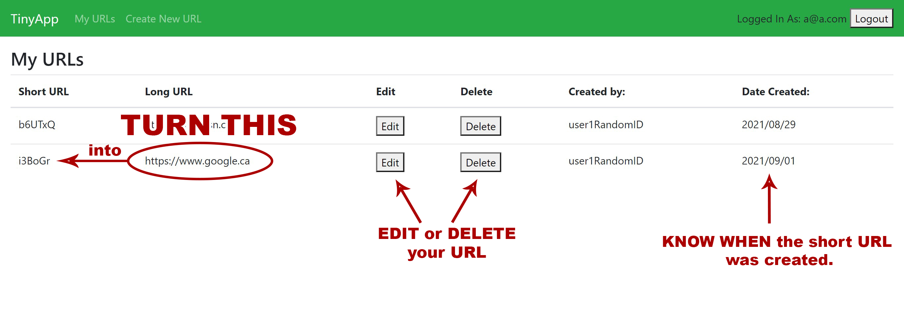

# TinyApp Project

TinyApp is a full stack web application built with Node and Express that allows users to shorten long URLs (à la bit.ly). Turn long URL into short URL. Amazing!

Features:
- CREATE a New URL
- EDIT your URL
- DELETE your URL
- KNOW WHEN the short URL was created.
- REGISTER and LOGIN to your account to manage your URLs.

## Final Product

## Dependencies

- Node.js
- Express
- EJS
- bcrypt
- body-parser
- cookie-session

## Getting Started

- Install all dependencies (using the `npm install` command).
- Run the development web server using the `node express_server.js` command.

For Demo/Testing purpose:
- Use a@a.com as the email address and "aaa" as the password.
- Or use b@b.com / password: "bbb".